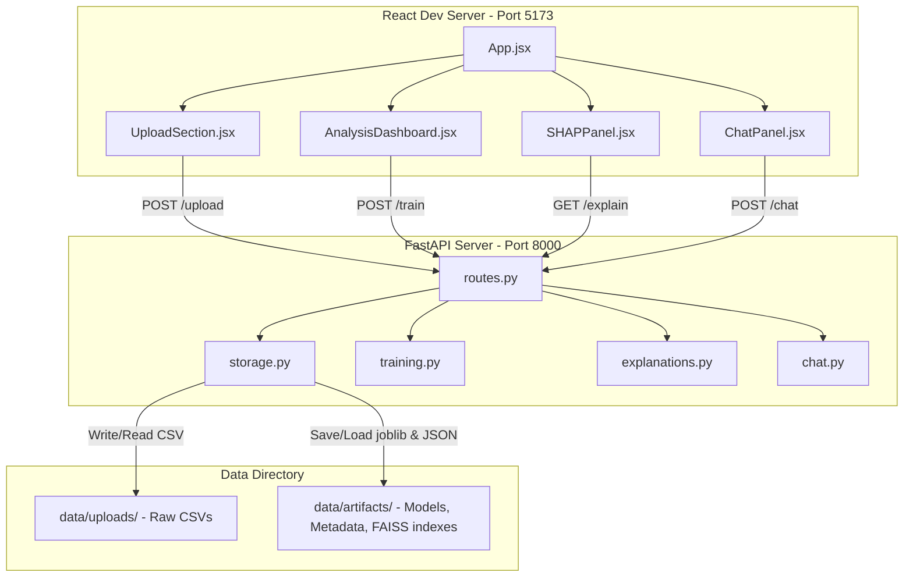

# Interview Guide: Autonomous AI Data Scientist

This document serves as a comprehensive preparation guide for your interview. It details the architecture, file-by-file structure, execution workflow, and core technical designs of the **Autonomous AI Data Scientist** application.

---

## 1. Project Overview & Architecture

The **Autonomous AI Data Scientist** is a production-style, full-stack application designed to automate the tabular data science workflow. It acts as an autonomous agent that takes raw CSV data and handles:
1. **Data Ingestion & Schema Profiling**
2. **Auto-Preprocessing & Feature Engineering**
3. **Model Training, Evaluation & Selection** (Comparing Random Forest and XGBoost)
4. **Model Explainability** (using SHAP values for global and local insights)
5. **Natural Language Interrogation** (using RAG via FAISS and OpenAI LLMs)

### High-Level Architecture Diagram


---

## 2. File-by-File Breakdown

### A. Backend Architecture (`backend/app/`)

#### 1. [main.py](backend/app/main.py)
*   **Role**: FastAPI entry point.
*   **What it does**: Initializes the FastAPI app, configures CORS middleware (vital for frontend communication, and supports GitHub Codespaces environments), and mounts the API router.
*   **Key Detail**: Implements a `/health` endpoint to check if the backend service is running.

#### 2. [core/config.py](backend/app/core/config.py)
*   **Role**: Configuration and Environment Management.
*   **What it does**: Uses Pydantic's `BaseSettings` to load and validate environment variables (like `OPENAI_API_KEY`, `OPENAI_MODEL`). Sets up base data paths on disk (`data/uploads` and `data/artifacts`).
*   **Interview Talking Point**: Features a cached configuration loader (`@lru_cache`) to ensure `.env` parameters are parsed once and reused efficiently across the app life cycle.

#### 3. [models/schemas.py](backend/app/models/schemas.py)
*   **Role**: Data Serialization & Validation Contracts.
*   **What it does**: Defines the Pydantic request/response schemas for all routes:
    *   `UploadResponse`: Metadata and 5-row preview of the uploaded file.
    *   `TrainRequest` & `TrainResponse`: Target column selector, metrics, and EDA profiles.
    *   `ExplainResponse`: Details predictions, local SHAP values, and global feature importance.
    *   `ChatRequest` & `ChatResponse`: Natural language inputs, outputs, and sources retrieved during RAG.

#### 4. [services/storage.py](backend/app/services/storage.py)
*   **Role**: Disk Persistence Layer.
*   **What it does**: Handles reading/writing datasets and model binary files.
*   **Key Detail**: Generates unique UUIDs (`dataset_id`) for every upload. Uses `joblib` to write/load machine learning objects (preprocessor state, trained models, label encoders) and standard JSON for run summaries.

#### 5. [services/training.py](backend/app/services/training.py)
*   **Role**: Autonomous Machine Learning Engine.
*   **What it does**:
    *   **Identifier Inference**: Automatically flags columns likely to be keys/IDs (e.g., `customer_id`, `id`, or numeric columns with 100% uniqueness) and drops them from feature sets.
    *   **Target Selection**: Auto-detects standard target columns (e.g., `churn`, `label`, `class`, `target`) or falls back to the last column.
    *   **Task Type Inference**: Analyzes target cardinality; if the target is non-numeric, object-like, or has very few unique values ($\leq 20$), it classifies the task as "classification", otherwise "regression".
    *   **EDA Analysis**: Builds statistical profiles (null distributions, min/max/mean/standard deviation for numerics, class balance).
    *   **Pipeline Assembly**: Sets up a scikit-learn `ColumnTransformer` with `SimpleImputer` (median for numbers, mode for categorical) and `OneHotEncoder` (handling unseen values dynamically).
    *   **Model Comparison**: Evaluates Random Forest vs XGBoost models using K-Fold or Stratified K-Fold Cross-Validation. The model with the highest cross-validation metric is selected, trained on the full dataset, and saved.

#### 6. [services/explanations.py](backend/app/services/explanations.py)
*   **Role**: Explainable AI (XAI) Engine.
*   **What it does**:
    *   Retrieves the saved pipeline components.
    *   Uses **SHAP (Shapley Additive exPlanations)** with a `TreeExplainer` optimized for tree-based models.
    *   Computes **Global Importance** by taking the mean absolute SHAP values across all rows.
    *   Computes **Local Explanations** for a selected row index, returning positive and negative forces acting on that specific prediction.

#### 7. [services/chat.py](backend/app/services/chat.py)
*   **Role**: Tabular Retrieval-Augmented Generation (RAG) Service.
*   **What it does**:
    *   Generates a text profile of the dataset (columns, rows, description statistics).
    *   Translates individual rows into descriptive text snippets (e.g., "Row 1: customer_id: 1234, age: 34, churn: Yes").
    *   Initializes a **FAISS** vector database using `OpenAIEmbeddings` to index these documents.
    *   Invokes LangChain's `create_retrieval_chain` with a `ChatOpenAI` instance to answer dataset-specific questions in natural language.

#### 8. [api/routes.py](backend/app/api/routes.py)
*   **Role**: API Controller / Routing Layer.
*   **What it does**: Maps incoming REST requests to the appropriate service methods. Includes CSV file parser wrappers that test different encodings (`utf-8`, `latin-1`, etc.) to prevent read failures.

---

### B. Frontend Architecture (`frontend/src/`)

#### 1. [App.jsx](frontend/src/App.jsx)
*   **Role**: Application State Coordinator.
*   **What it does**: Tracks state variables (active dataset metadata, training results, current SHAP local explanations, RAG chat message history, loading states, and status alerts). Contains standard helper functions to parse CSV headers locally on the user's browser prior to upload.

#### 2. [components/UploadSection.jsx](frontend/src/components/UploadSection.jsx)
*   **Role**: Step 1 - Ingestion UI.
*   **What it does**: Provides a drag-and-drop file interface. It lets users optionally override the auto-detected target column. Once uploaded, it displays dataset metrics and a spreadsheet-like preview.

#### 3. [components/AnalysisDashboard.jsx](frontend/src/components/AnalysisDashboard.jsx)
*   **Role**: Step 2 - Auto-ML Dashboard.
*   **What it does**: Displays the selected model, validation metric metrics, and statistical breakdowns of the dataset. Uses a **Recharts** dual-bar graph to compare the holdout metrics against cross-validation metrics across models.

#### 4. [components/SHAPPanel.jsx](frontend/src/components/SHAPPanel.jsx)
*   **Role**: Step 3 - Interpretability UI.
*   **What it does**: Renders model predictions, confidence levels, and maps them directly to global and local importance bar charts. Enables the user to inspect any row in the dataset.

#### 5. [components/FeatureBarChart.jsx](frontend/src/components/FeatureBarChart.jsx)
*   **Role**: Custom Visualization component.
*   **What it does**: Displays horizontal bar charts. For local SHAP explanations, it colors positive pushes (increasing prediction value) in orange-coral and negative pushes (decreasing prediction value) in teal.

#### 6. [components/ChatPanel.jsx](frontend/src/components/ChatPanel.jsx)
*   **Role**: Step 4 - Natural Language Interrogation.
*   **What it does**: Renders the conversation log. Shows source annotations (indicating which exact rows the LLM referenced to formulate its answer).

---

## 3. End-to-End Workflow & Data Movement

```
   [User Uploads CSV] 
           │
           ▼
┌──────────────────────┐
│  POST /upload        │  Reads CSV, profiles shape/headers, 
└──────────┬───────────┘  generates UUID, saves dataset to disk.
           │
           ▼
┌──────────────────────┐
│  POST /train         │  Infers target/task type, imputes nulls, 
└──────────┬───────────┘  one-hot encodes, trains RF vs XGBoost, 
           │              runs Cross-Val, saves winning artifacts.
           ▼
┌──────────────────────┐
│  GET /explain        │  Retrieves pipeline, calculates predictions, 
└──────────┬───────────┘  runs Tree SHAP on rows, parses local/global inputs.
           │
           ▼
┌──────────────────────┐
│  POST /chat          │  Converts tabular rows to documents, builds FAISS 
└──────────────────────┘  vector database, runs RAG query via LangChain.
```

1.  **File Upload**: The user drops `customer_churn.csv` into the UI. The frontend extracts the headers to populate a target column dropdown. Clicking "Upload Dataset" sends the CSV to `/upload`. The backend saves it to `backend/data/uploads/{dataset_id}.csv` and returns the file metadata and a 5-row preview.
2.  **Autonomous Training**: The user clicks "Run AI Analysis". The frontend calls `/train`. The backend loads the CSV, parses the target (e.g. `churn`), detects that it is classification, drops identifier columns (e.g. `customer_id`), trains a categorical transformer, processes features, split-tests the data, and runs Stratified 5-Fold Cross Validation comparing Random Forest vs. XGBoost. The winner is saved, and statistical metrics are returned.
3.  **Explainable AI Generation**: The user enters a row index (e.g. `row 3`) and requests an explanation. The frontend calls `/explain`. The backend calculates SHAP values. The results are transformed into global importance and local force offsets, returning the predicted class, actual value, and contributing features.
4.  **Semantic Dataset Queries**: The user types a natural language query (e.g., "Show customers on month-to-month contracts"). The backend converts the first 250 rows of the dataset into paragraph representations, embeds them with OpenAI Embeddings, queries the vector space with FAISS, retrieves the top 4 matched row contexts, feeds them to GPT, and yields a contextually accurate response.

---

## 4. Key Engineering & Data Science Features

### 1. Smart Feature Pipeline & Auto-Preprocessing
Machine learning models cannot directly consume raw categorical data or datasets with missing values. The project employs a robust pipeline to prevent target leakage and handle real-world datasets:
*   **Identifier Protection**: Identifier variables (high-cardinality keys like unique account strings) must be excluded to prevent models from memorizing row indexes instead of learning generalized patterns. The `infer_identifier_columns` logic safely drops these features.
*   **Imputation without Leakage**: The application builds a pipeline structure ensuring the `preprocessor` calculates medians and modes strictly from the training folds and applies those exact values to testing folds/prediction queries, preventing data leakage.
*   **High-Dimensional Encoding**: Employs `OneHotEncoder` configured with `handle_unknown="ignore"`. If new categorical labels appear during runtime explainability or evaluation, they don't break the application; they are safely zero-represented.

### 2. Autonomous Model Tournament
Instead of relying on a single static architecture, the app implements a mini-tournament:
*   **Stratified Cross-Validation**: If classification is active, `StratifiedKFold` ensures class proportions are equal in each fold. If regression is active, `KFold` is used.
*   **Metric Choice**: Classification models are ranked by `accuracy`, while regression models are ranked by $R^2$ (coefficient of determination).
*   **The Challenger Approach**: The system trains and cross-validates a Scikit-Learn **Random Forest** alongside an **XGBoost** model. The model that records the superior cross-validation score is selected.

### 3. Tree SHAP Explainability
*   **Additive Feature Contributions**: Standard feature importances (e.g., Gini importance in Forests) are biased and only show global impact. **SHAP** calculates Shapley values based on game theory to allocate fair credit to each feature for a specific prediction offset from the baseline value.
*   **Optimized Performance**: The service runs a Tree SHAP explainer (`shap.TreeExplainer`). This tree-specific optimization allows computing explanations in polynomial time instead of exponential time, making real-time user dashboard explanations feasible.
*   **Aligning Categorical Maps**: One-hot encoding splits a single categorical variable (e.g., `contract_type`) into multiple binary columns (e.g., `contract_type_One year`, `contract_type_Two year`). The SHAP service maps the weights back to the final high-dimensional encoded features returned by `get_feature_names_out()`.

### 4. Vectorized RAG for Tabular Formats
Traditional RAG models struggle with tabular data because databases lack text narratives. This project handles this with a hybrid solution:
*   **Metadata Injector**: Creates a global schema summary page-content document outlining the dimensions, column types, and numerical statistics.
*   **Row-as-a-Document Parser**: Dynamically flattens tabular records. For instance, customer information is converted to:
    > "Row 3: customer_id: 4567, age: 45, contract_type: Two year, churn: No"
*   **FAISS & LangChain**: Embeds text representations using OpenAI. A user's query ("Show customers on month-to-month contracts") is embedded, and FAISS returns the most similar customer rows as text. These rows are injected as context into the prompt, allowing the LLM to summarize findings accurately without hallucinating.

---

## 5. Key Interview Questions & Talking Points

Here are answers to potential questions you might face during your interview:

### Q1: "Why do you run Cross-Validation to select the model, rather than just training on the full set and choosing the model with the best score?"
> **Answer**: Choosing a model based purely on its training score leads to overfitting; models like Random Forest and XGBoost can easily memorize training data and achieve 100% accuracy. Using cross-validation splits the data into multiple folds, training on some and validating on others. This provides a realistic estimation of how the model generalizes to unseen data. We select the winning model based on this cross-validation score, and then evaluate it on a separate holdout set to report final metrics.

### Q2: "Tabular RAG has limitations. How does your vector search scale if the dataset has 1 million rows?"
> **Answer**: Currently, the system builds text representation documents for the first 250 rows to fit within context limits and keep embedding latency low. For large-scale data, flattening every row into an embedding document becomes inefficient. In a production setting, I would augment this RAG pipeline with a **structured SQL agent**. When a query requires global database calculations, the agent generates and runs SQL queries; if the query is semantic, it falls back to vector search.

### Q3: "What is the benefit of SHAP over standard Random Forest Feature Importance?"
> **Answer**: Traditional tree importances (like Gini split criteria) are biased toward numerical or high-cardinality features and only offer global averages. They cannot explain *why* a specific prediction was made for a particular customer. SHAP values are mathematically grounded in game theory (Shapley values). They calculate the exact additive contribution of each feature to a specific prediction, showing whether a feature pushed the prediction above or below the dataset's base rate.

### Q4: "How does the backend ensure it doesn't crash when encountering missing values?"
> **Answer**: We use scikit-learn's `Pipeline` object combined with a `ColumnTransformer`. For numerical features, a `SimpleImputer` replaces missing values (`NaN`) with the median of the column. For categorical features, missing values are imputed with the most frequent value (mode) before being one-hot encoded. Because the imputer and encoder are bundled inside the saved pipeline, any raw row selected by the user is processed using these same steps before a prediction is made.
